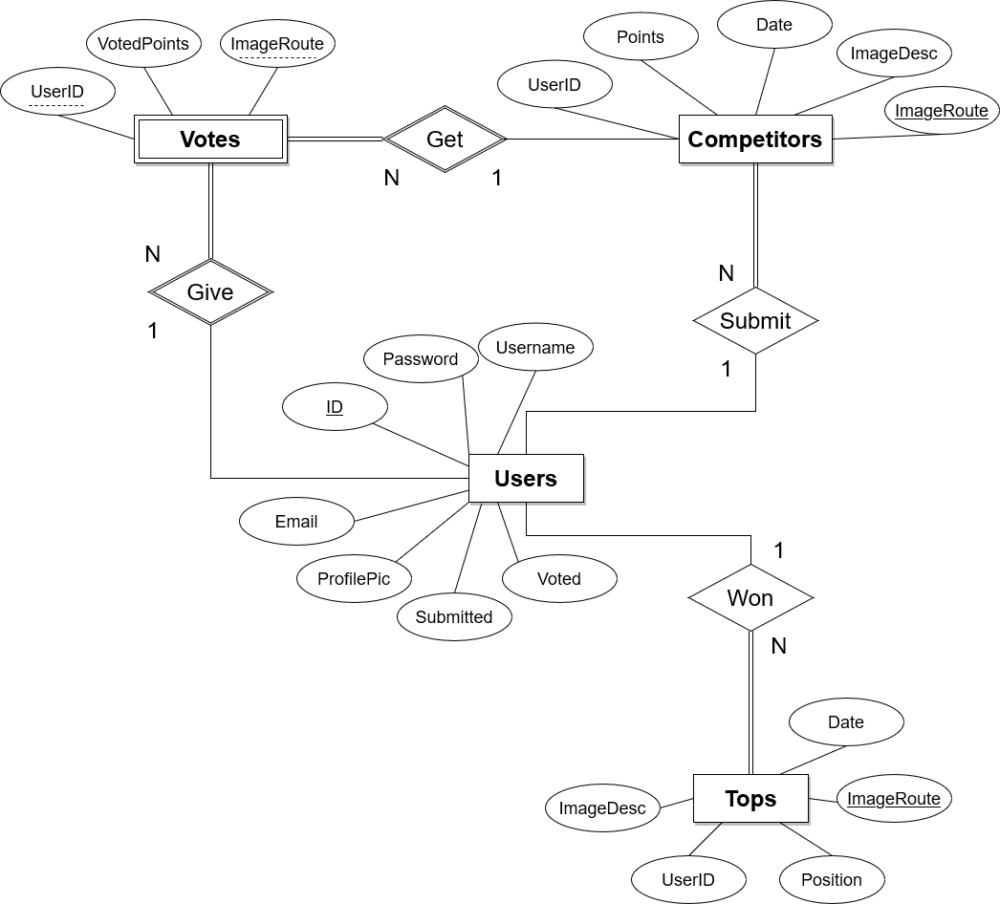

# PiComp
Creación de app web de publicación, valoración y competición de imágenes.

React (front-end), Node (back-end) and MySql (database).

# Prerrequisitos

## Preparación de la Base de Datos

Diagrama de la base de datos:



Crea de la base de datos:
```
CREATE DATABASE picomp;
```

Crea las tablas necesarias:
```
CREATE TABLE users (
  id INT AUTO_INCREMENT NOT NULL PRIMARY KEY,
  username VARCHAR(50) UNIQUE NOT NULL,
  email VARCHAR(100) NOT NULL,
  password VARCHAR(100) NOT NULL,
  profilePic VARCHAR(100) NOT NULL,
  submitted BOOLEAN NOT NULL default FALSE,
  voted BOOLEAN NOT NULL default FALSE
);
```


```
CREATE TABLE competitors (
  imageRoute VARCHAR(100) NOT NULL PRIMARY KEY,
  imageDesc VARCHAR(100) NOT NULL,
  userID INT NOT NULL,
  points INT NOT NULL,
  date DATE NOT NULL,
  FOREIGN KEY(userID) REFERENCES USERS(ID)
    ON DELETE CASCADE
);
```


```
CREATE TABLE tops (
  imageRoute VARCHAR(100) NOT NULL PRIMARY KEY,
  imageDesc VARCHAR(200) NOT NULL,
  userID INT,
  position INT NOT NULL,
  date DATE NOT NULL,
  FOREIGN KEY(userID) REFERENCES USERS(ID)
    ON DELETE SET NULL
);
```


```
CREATE TABLE votes (
  imageRoute VARCHAR(100) NOT NULL,
  userID INT NOT NULL,
  votedPoints INT NOT NULL,
  PRIMARY KEY (imageRoute, userID),
  FOREIGN KEY(userID) REFERENCES USERS(ID)
    ON DELETE CASCADE,
  FOREIGN KEY(imageRoute) REFERENCES COMPETITORS(imageRoute)
    ON DELETE CASCADE
);
```


> mysql> describe users;
> | Field      | Type         | Null | Key | Default | Extra           |
> |------------|--------------|------|-----|---------|-----------------|
> | id         | int          | NO   | PRI | NULL    | auto_increment  |
> | username   | varchar(50)  | YES  | UNI | NULL    |                 |
> | email      | varchar(100) | YES  |     | NULL    |                 |
> | password   | varchar(100) | YES  |     | NULL    |                 |
> | profilePic | varchar(100) | YES  |     | NULL    |                 |
> | submitted  | tinyint(1)   | NO   |     | 0       |                 |
> | voted      | tinyint(1)   | NO   |     | 0       |                 |

> mysql> desc competitors;
> | Field      | Type         | Null | Key | Default | Extra |
> |------------|--------------|------|-----|---------|-------|
> | imageRoute | varchar(100) | NO   | PRI | NULL    |       |
> | imageDesc  | varchar(100) | NO   |     | NULL    |       |
> | userID     | int          | NO   | MUL | NULL    |       |
> | points     | int          | NO   |     | NULL    |       |

> mysql> desc tops;
> | Field      | Type         | Null | Key | Default | Extra |
> |------------|--------------|------|-----|---------|-------|
> | imageRoute | varchar(100) | NO   | PRI | NULL    |       |
> | imageDesc  | varchar(200) | NO   |     | NULL    |       |
> | userID     | int          | YES  | MUL | NULL    |       |
> | position   | int          | NO   |     | NULL    |       |
> | date       | date         | NO   |     | NULL    |       |

> mysql> desc votes;
> | Field       | Type         | Null | Key | Default | Extra |
> |-------------|--------------|------|-----|---------|-------|
> | imageRoute  | varchar(100) | NO   | PRI | NULL    |       |
> | userID      | int          | NO   | PRI | NULL    |       |
> | votedPoints | int          | NO   |     | NULL    |       |


#

*Una vez la base de datos está preparada se recomienda crear un .env.*
### Un ejemplo de .env puede ser: 
```
#Environment variables.
PORT=<server_port>

#DB CONFIG
DB_HOST=db.host
DB_USER=root
DB_PASSWORD=db.password
DB_DATABASE=db.name

#AWS CONFIG
AWS_ACCESS_KEY_ID=<accessKey>
AWS_SECRET_ACCESS_KEY=<secretAccessKey>
REGION=<bucketRegion>
```
